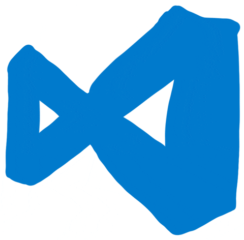

<h1 align="center"> Howdy! I'am Gururaj Jeerge. 👋 </h1>


[](https://gururaj.live)
[](https://twitter.com/iamjeerge)

## I'm a Creative | Coder | Developer | Dreamer!

-   🌱 Currently working on creating platform to run ML model [Train / Inference / Benchmark]
-   🥅 2025 Goals: Building scalable ML infrastructure and contributing to open source AI projects
-   🚀 Passionate about MLOps, cloud-native applications, and developer tooling
-   ⚡ Fun fact: I love to play video games and explore new technologies

## 💻 Languages

<p float="left">
    <a href="https://www.python.org/" target="_blank" >
    
    </a>
    <a href="https://www.javascript.com/" target="_blank" >
    
    </a>
    <a href="https://reactjs.org/" target="_blank" >
    
    </a>
    <a href="https://html.com/" target="_blank" >
    
    </a>
    <a href="https://developer.mozilla.org/en-US/docs/Web/CSS" target="_blank" >
    
    </a>
</p>

## 🤖 Machine Learning

<p float="left">
    <a href="https://www.tensorflow.org/" target="_blank" >
     
    </a>
    <a href="https://pytorch.org/" target="_blank" >
    
    </a>
</p>

## ⚡ Edge Computing & Hardware

<p float="left">
    <a href="https://developer.nvidia.com/embedded/jetson-nano-developer-kit" target="_blank" >
    
    </a>
    <a href="https://www.arduino.cc/" target="_blank" >
    
    </a>
    <a href="https://en.wikipedia.org/wiki/Lidar" target="_blank" >
    
    </a>
</p>

## 🌐 Web Framework

<p float="left">
    <a href="https://www.djangoproject.com/" target="_blank" >
    
    </a>
    <a href="https://flask.palletsprojects.com/" target="_blank" >
    
    </a>
    <a href="https://fastapi.tiangolo.com/" target="_blank" >
    
    </a>
</p>

## 📱 Mobile Application Development

<p float="left">
    <a href="https://reactnative.dev/" target="_blank" >
    
    </a>
    <a href="https://developer.apple.com/ios/" target="_blank" >
    
    </a>
    <a href="https://developer.android.com/" target="_blank" >
    
    </a>
</p>

## 🗄️ Databases

<p float="left">
    <a href="https://www.postgresql.org/" target="_blank" >
    
    </a>  
</p>

## 🛠️ Tools

<p float="left">
    <a href="https://www.docker.com/" target="_blank" >
     
    </a>
    <a href="https://kubernetes.io/" target="_blank" >
    
    </a>
    <a href="https://code.visualstudio.com/" target="_blank" >
    
    </a>
    <a href="https://docs.celeryproject.org/" target="_blank" >
    
    </a>
    <a href="https://www.rabbitmq.com/" target="_blank" >
    
    </a>
    <a href="https://redis.io/" target="_blank" >
    
    </a>
</p>

## 📊 Programming Stats

<!--START_SECTION:waka-->

```txt
🔭 Always learning and building amazing things!
📈 Check back soon for updated programming statistics
```

<!--END_SECTION:waka-->

## 🌐 Connect with me

[][website]
[][twitter]
[][linkedin]
[][instagram]

[website]: https://gururaj.live
[twitter]: https://twitter.com/iamjeerge
[linkedin]: https://in.linkedin.com/in/jeerge
[instagram]: http://instagram.com/iamjeerge
