<div align="center">


[](https://git.io/typing-svg)

<br/>

[](https://gururaj.live)
[](https://twitter.com/iamjeerge)
[](https://in.linkedin.com/in/iamjeerge)
[](http://instagram.com/iamjeerge)
[](mailto:jeerge@live.in)


</div>

---

```python
class Gururaj(Physicist, Mathematician, SoftwareEngineer):

    stack     = ["Python", "PyTorch", "TensorFlow", "FastAPI", "Swift", "TypeScript"]
    domains   = ["Renewable Energy Physics", "Drone Intelligence", "Computer Vision", "Grid Optimisation"]
    verticals = ["Wind Energy 🌬️", "Solar Assets ☀️", "Oil & Gas 🛢️", "Properties 🏘️"]
    hardware  = ["NVIDIA Jetson", "Raspberry Pi", "UAV Systems", "Edge AI Devices"]
    at        = "Zeitview — drone intelligence for energy infrastructure inspection"
    building  = "ML platform: Aerial Capture → Physics Analysis → Asset Intelligence"

    @staticmethod
    def approach(problem: EnergyAsset) -> Intelligence:
        drone     = fly(over=asset, capture=["RGB", "thermal", "LiDAR"])  # data from the sky
        equations = formulate(physics + mathematics)                       # ∇²ψ + k²ψ = 0
        model     = translate(equations, to=code)                          # theory → software
        result    = experiment(model, data=drone.payload)                  # measure everything
        return iterate(result, until=converged)                            # gradient descent on life
```

---

## 🌍 Who I Am

> *"The most incomprehensible thing about the universe is that it is comprehensible."* — Einstein
> My job is to make that comprehension **computable** — and deploy it on a drone.

I'm a **physics-informed AI engineer** at [**Zeitview**](https://www.zeitview.com), building intelligent systems that help the world understand, maintain, and optimise its energy infrastructure — **from the sky**.

Drones fly. They collect terabytes of RGB, thermal, and LiDAR data over wind farms, solar fields, oil & gas pipelines, and real estate. My job starts after the drone lands — turning raw aerial data into **actionable asset intelligence** using the same mathematics that governs the physical systems being inspected.

Whether that's a **wind turbine wake deficit** modelled by the Jensen PDE (validated to <5% RMSE against 80 Vestas turbines at Horns Rev), a **grid curtailment** problem solved with MILP delivering 73% revenue uplift, or a **blade defect** classified through nonlinear scale-space operators — **every system I build starts with a governing equation**.

---

## ⚡ Domain Coverage

<div align="center">

|  🌬️ **Wind Energy** | ☀️ **Solar Assets** |
|---|---|
| Wake loss modelling · Power curve analysis | Panel inspection · Thermal anomaly detection |
| Blade integrity · Turbine health monitoring | Irradiance modelling · Yield forecasting |
| AEP estimation · Layout optimisation (GA) | Soiling & degradation classification |
| **🛢️ Oil & Gas** | **🏘️ Properties** |
| Pipeline integrity · Flare monitoring | Aerial survey · Structural assessment |
| Leak detection · Asset condition scoring | Site mapping · Defect classification |
| Offshore platform inspection | Construction monitoring · Progress tracking |

</div>

---

## ⚗️ Experiments & Results

| Experiment | Approach | Verified Outcome |
|---|---|---|
| 🚀 **ML Platform** (Train → Inference → Benchmark) | Distributed queueing · auto-differentiation | 🔬 Active |
| 🌬️ **Wind Farm Wake Loss** — Jensen + Bastankhah | Gaussian deficit · Weibull AEP · genetic layout opt | **<5% RMSE vs Horns Rev field data** |
| ⚡ **Grid-Aware Curtailment Engine** | MILP (Pyomo/GLPK) + RL (PPO/Gymnasium) | **73% revenue uplift · <10% curtailment · 0 grid violations** |
| 🔩 **2D Internal Blade Inspection** | Scale-space · morphological reconstruction | **Production @ Zeitview** |
| 👁️ **KAZE Feature Mapping** | Perona-Malik PDE · M-SURF descriptors | **Aerial imagery feature extraction** |
| 📐 **Power Ratio Computation** | Weibull distribution · AEP yield curves | **Energy performance benchmarking** |
| 📱 **iOS YOLOv5 On-device Detection** | CoreML quantisation · fixed-point inference | **Real-time object detection on iPhone** |

---

## 🔬 The Physics Behind the Code

> Every project maps to governing equations. Here's what mine look like:

| Project | Governing Model |
|---|---|
| 🌬️ Wind farm wake loss | Jensen linear expansion · Bastankhah Gaussian deficit $\sigma(x) = k^*x + D/2\sqrt{2}$ · Weibull AEP |
| ⚡ Grid curtailment engine | MILP: minimise curtailment s.t. grid capacity, battery SOC, ramp-rate constraints · Lagrangian relaxation |
| 🔩 Blade inspection | Canny edge detection · morphological reconstruction · defect geometry classification |
| 🌊 KAZE feature mapping | Perona-Malik PDE $L_t = \mathrm{div}(c(x,y,t)\nabla L)$ · nonlinear scale space · M-SURF |
| 👁️ Object detection (YOLO) | Conv feature maps · anchor regression · IoU loss · non-maximum suppression |
| 🧠 ML platform design | Distributed queueing theory · compute graph optimisation · gradient accumulation |
| 📱 iOS CoreML inference | Quantised linear algebra · fixed-point arithmetic · memory-bandwidth bounds |

---

## 📊 GitHub Stats

<div align="center">


</div>

<div align="center">


</div>

---

## 💻 Tech Stack

**Languages**

<p>
  <a href="https://www.python.org/">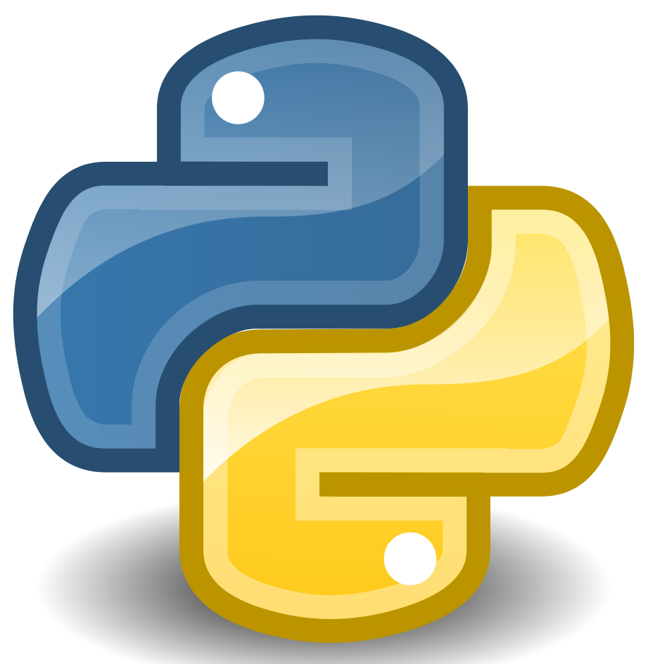</a>&nbsp;
  <a href="https://www.javascript.com/">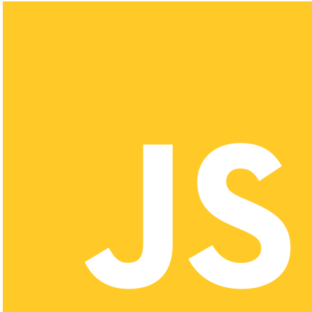</a>&nbsp;
  <a href="https://reactjs.org/"></a>&nbsp;
  <a href="https://html.com/"></a>&nbsp;
  <a href="https://developer.mozilla.org/en-US/docs/Web/CSS">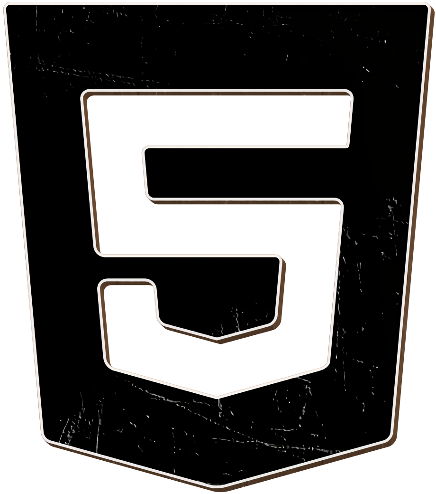</a>
</p>

**Machine Learning & AI**

<p>
  <a href="https://www.tensorflow.org/">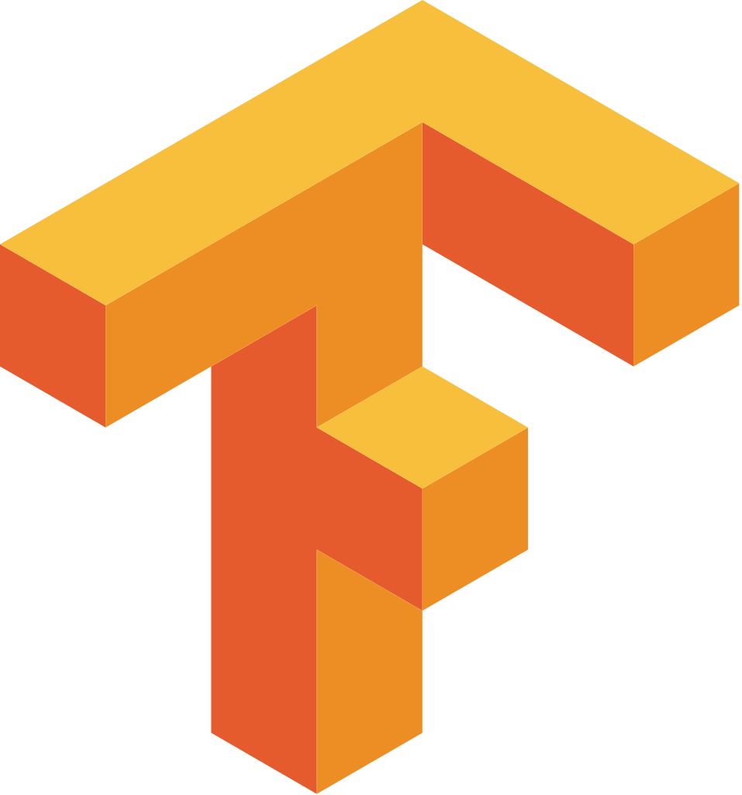</a>&nbsp;
  <a href="https://pytorch.org/">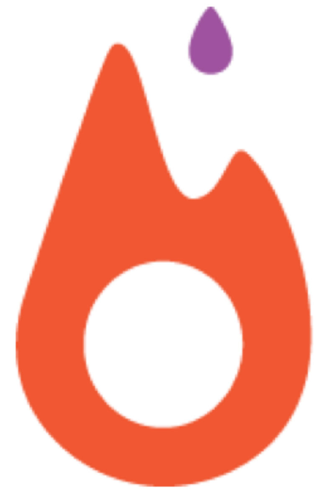</a>
</p>

**Backend & APIs**

<p>
  <a href="https://fastapi.tiangolo.com/">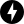</a>&nbsp;
  <a href="https://www.djangoproject.com/"></a>&nbsp;
  <a href="https://flask.palletsprojects.com/">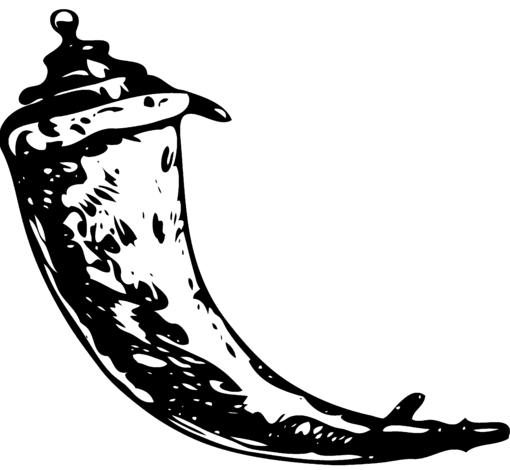</a>&nbsp;
  <a href="https://docs.celeryproject.org/">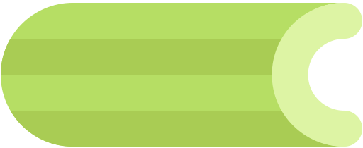</a>&nbsp;
  <a href="https://www.rabbitmq.com/">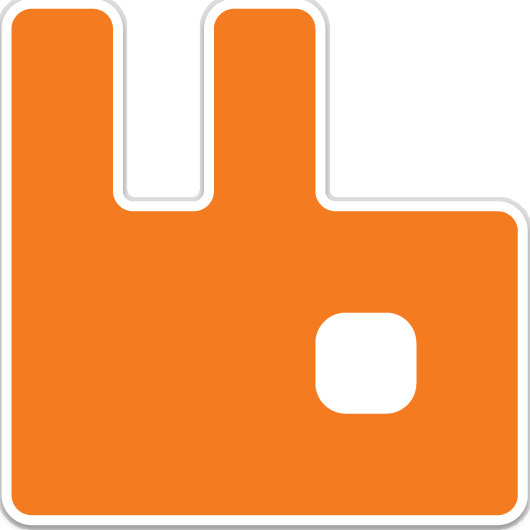</a>&nbsp;
  <a href="https://redis.io/">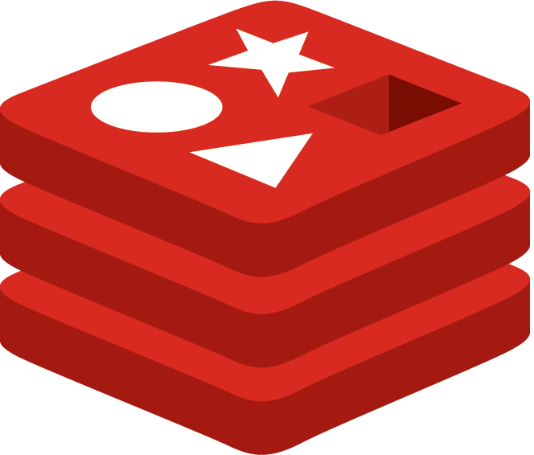</a>
</p>

**Mobile**

<p>
  <a href="https://reactnative.dev/">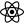</a>&nbsp;
  <a href="https://developer.apple.com/ios/"></a>&nbsp;
  <a href="https://developer.android.com/">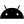</a>
</p>

**Infrastructure & Data**

<p>
  <a href="https://www.docker.com/"></a>&nbsp;
  <a href="https://kubernetes.io/"></a>&nbsp;
  <a href="https://www.postgresql.org/">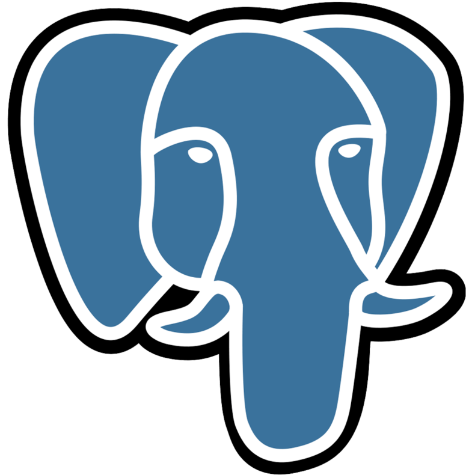</a>&nbsp;
  <a href="https://code.visualstudio.com/"></a>
</p>

**Edge & Hardware**

<p>
  <a href="https://developer.nvidia.com/embedded/jetson-nano-developer-kit">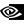</a>&nbsp;
  <a href="https://www.raspberrypi.com/">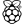</a>&nbsp;
  <a href="https://www.arduino.cc/"></a>
</p>

---

## 🚀 Experiments → Shipped

<div align="center">

[](https://github.com/iamjeerge/Wind-Farm-Wake-Loss-and-Power-Loss-Estimation)
[](https://github.com/iamjeerge/grid-aware-curtailment-engine)
[](https://github.com/iamjeerge/ios-object-detection-yolov5)
[](https://github.com/iamjeerge/ComputerVisionPractice)
[](https://github.com/iamjeerge/django-tensorflow-docker)
[](https://github.com/iamjeerge/pr_calculator_data_fetch)

</div>

---

## 🐍 Contribution Graph

<div align="center">

<picture>
  <source media="(prefers-color-scheme: dark)" srcset="https://raw.githubusercontent.com/iamjeerge/iamjeerge/output/github-contribution-grid-snake-dark.svg" />
  <source media="(prefers-color-scheme: light)" srcset="https://raw.githubusercontent.com/iamjeerge/iamjeerge/output/github-contribution-grid-snake.svg" />
  
</picture>

</div>

---

<div align="center">


</div>

[](https://git.io/typing-svg)

<br/>

[](https://gururaj.live)
[](https://twitter.com/iamjeerge)
[](https://in.linkedin.com/in/iamjeerge)
[](http://instagram.com/iamjeerge)
[](mailto:jeerge@live.in)


</div>
